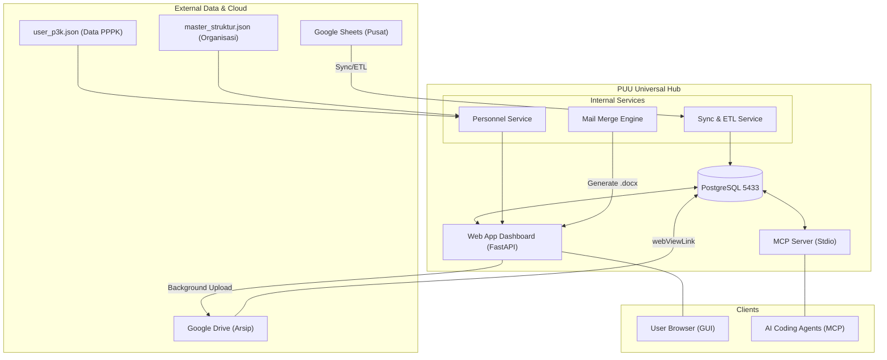
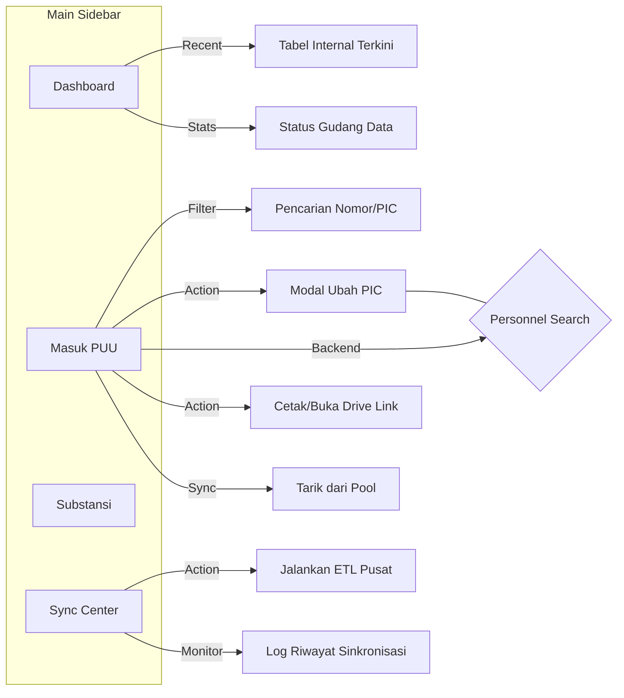

# Korespondensi Universal Web Hub & MCP Server

Aplikasi ini merupakan transformasi terpusat (Universal Server) untuk manajemen korespondensi PUU di lingkungan Kemendagri. Berawal dari server MCP sederhana, sistem ini kini telah ditingkatkan menjadi **Web App Full-Stack Premium** sekaligus **Server MCP** yang membagi basis pengetahuan dan fungsi database yang sama.

## 🌟 Fitur Utama

1.  **Premium Hybrid GUI (Card & Table View)**: Antarmuka modern yang mendukung perpindahan mode tampilan secara instan.
    *   **Mode Tabel**: Untuk manajemen data massal yang padat dan efisien.
    *   **Mode Kartu (Glassmorphism)**: Visualisasi premium dengan efek transparansi, bayangan dinamis, dan animasi *fade-in* yang memberikan kesan mewah.
2.  **Pencarian Pegawai Real-time (Smart Search)**: Integrasi AJAX pada modal PIC yang memungkinkan pencarian identitas pegawai dari ribuan data `user_p3k.json` secara instan tanpa membebani browser.
3.  **Smart Ingestion (Strict Regex ETL)**: Pipa data otomatis yang melakukan pembersihan mendalam:
    *   **Regex Validasi Agenda**: Memastikan hanya surat dengan format registrasi resmi yang masuk ke sistem utama.
    *   **Extract Posisi Otomatis**: Mendeteksi lokasi fisik surat dan tanggal disposisi langsung dari teks acak di kolom posisi.
4.  **Auto-Sequence Agenda Persisten**: Sistem penomoran internal (`001-I`, `002-I`, dst.) yang bersifat permanen dan terkalibrasi secara kronologis berdasarkan tanggal masuk nyata, bukan waktu sinkronisasi.
5.  **Google Drive Auto-Backup & Dynamic Linking**: Integrasi cloud tanpa celah. Setiap dokumen `.docx` yang dihasilkan langsung dicadangkan ke Drive. GUI secara dinamis mengubah tombol "Cetak" menjadi "Buka di Google Docs" jika file sudah tersedia di cloud.
6.  **Timeline Monitoring**: Pelacakan riwayat pergerakan surat secara vertikal di UI, memungkinkan admin melihat perjalanan dokumen dari satu meja ke meja lainnya secara kronologis.
7.  **Dashboard Analytics**: Visualisasi beban kerja Top 5 PIC secara real-time untuk pemantauan distribusi tugas yang lebih adil dan transparan.
8.  **Universal MCP Server**: Backend yang siap melayani Agen AI (seperti Antigravity atau OpenHands) dengan tools khusus untuk pencarian dan analisis surat secara otonom.

## 🎨 Design System & Aesthetics

Aplikasi ini mengadopsi prinsip desain **Modern Glassmorphism 2026**:
*   **Typography**: Menggunakan font *Inter* dan *Outfit* untuk keterbacaan tinggi dan kesan profesional.
*   **Glassmorphism**: Lapisan antarmuka menggunakan `backdrop-filter: blur(14px)` dengan saturasi warna yang dikurasi (Navy-Blue & Slate accents).
*   **Micro-Animations**: Transisi antar halaman dan mode tampilan menggunakan kurva *cubic-bezier* untuk interaksi yang terasa "hidup".
*   **Color Palette**: Skema warna Slate-Primary dengan aksen Accent-Blue yang harmonis dan ramah mata untuk penggunaan durasi lama.

## 🏗️ Struktur Arsitektur



```
korespondensi-server/
├── src/
│   ├── main.py              # Entry point pusat
│   ├── mcp_server.py        # Modul integrasi Model Context Protocol
│   ├── web_app.py           # Aplikasi Web FastAPI
│   ├── database.py          # Modul Koneksi PostgreSQL terpusat
│   └── services/            # Modul logika sinkronisasi data & personel
├── static/                  # Design CSS file
├── templates/               # Koleksi Jinja2 template untuk Web GUI
├── run.sh                   # Script saklar mode aktivasi peladen
└── requirements.txt         # Daftar paket esensial Python
```

## 🖥️ Struktur Navigasi GUI (Web Dashboard)



## 🚀 Setup & Instalasi
Sistem berbasis *Python Virtual Environment* dan menggunakan *PostgreSQL* lokal pada port 5433 (`mcp_knowledge`).

1. Pastikan lingkungan virtual berada di `../.venv`.
2. Lakukan instalasi dependensi:
   ```bash
   /home/aseps/MCP/.venv/bin/python3 -m pip install -r requirements.txt
   ```
3. Konfigurasikan kredensial di `.env` merujuk pada profil `.env.example`.

## ⚙️ Petunjuk Penggunaan
Gunakan script `run.sh` untuk meluncurkan sistem.

**Mode Web App (Dashboard GUI)**
Rute default yang akan berjalan pada host `0.0.0.0` port `8081`. 
- Repositori Utama / Dashboard PUU: `http://localhost:8081`
- Pusat Antrean & Penetapan Dokumen (Internal): `http://localhost:8081/internal`
- Modul Tarik Data Baru Pusat (Sync Center): `http://localhost:8081/sync`
```bash
./run.sh web
```

**Mode MCP Server (Agen AI)**
Berjalan menggunakan komunikasi standar (stdio) khusus digunakan sebagai backend IDE atau LLM integrasi lain.
```bash
./run.sh mcp
```

## 📝 Fitur Mail Merge Lembar Disposisi Secara Native

Sistem ini telah mendukung konversi dan generasi **Lembar Disposisi** (format `.docx`) secara *native* langsung dari Dashboard Web tanpa lagi bergantung pada ekosistem lambat Google Apps Script. 

**Mekanisme Kerja:**
1. **Routing Interaktif**: Terdapat endpoint khusus `/api/disposisi/download/{unique_id}` pada `web_app.py`.
2. **Template Tersentralisasi**: Backend menggunakan modul `docxtpl` untuk mengganti *placeholder* bergaya Jinja (`{{ ... }}`) di dalam basis log template `template_disposisi_native.docx`.
3. **Pengunduhan & Pengalihan Dinamis**: Ketika pengguna menekan tombol **"📄 Cetak Disposisi (.docx)"**, sistem mengecek keberadaan `drive_file_url` di database. Jika ada, pengguna langsung diarahkan ke pratinjau Google Docs. Jika belum ada, file diolah sebagai *download object stream* dan proses unggah ke Drive dipicu di latar belakang.
4. **Auto-Sequence Agenda Persisten**: Sistem secara cerdas mengikat nomor sequence permanen (`001-I`, `013-I`, dst). Pengurutan antrean tidak didasari oleh waktu pembuatan surat, melainkan mengekstrak tanggal sungguhan menggunakan *Regex SQL* dari teks acak di kolom **"POSISI"** (mis. mendeteksi `PUU 28/1` sebagai 28 Januari). Nomor ini permanen tersimpan pada kolom database `agenda_puu` sesaat setelah proses *Ingestion/Sync*.
5. **Otomasi Penuh Field Dokumen**: Seluruh variabel pada *Lembar Disposisi* telah dicetak secara otomatis (Nomor ND, Hal, Asal). Bahkan bagian *Tanggal Diterima*—yang sebelumnya harus dikosongkan untuk input pulpen manual—kini sudah mampu diisi otomatis berkat kemampuan mesin mengekstrak riwayat tanggal dari kolom *POSISI*. (Hanya tersisa tanda tangan fisik saja yang butuh tinta).

## 🗺️ Peta Jalan & Rencana Pengembangan Lanjutan (Roadmap)

Sistem Web Hub Core ini secara aktif terus melebarkan sayapnya:

1. ✅ **[Selesai] Sinkronisasi Otomatis Archiving Google Drive (Background Task)** 
   Sistem telah mem-bypass batas Kuota API dengan metode otentikasi pendelegasian penuh token OAuth. Segala file disposisi hasil render web langsung direplikasi otomat ke balok arsip pusat `1s1Wywe...` via *Multithreading Background Task*.

2. ✅ **[Selesai] Transisi Pemandu Unduhan GUI ke Tautan Dinamis (Drive-Link)**
   Tombol *"📄 Cetak Disposisi"* di antarmuka Web telah ditingkatkan menggunakan logika *Redirect-First*:
   * Mesin mengecek ketersediaan `drive_file_url` yang ada di database.
   * Jika URL tersedia, tombol berubah menjadi **"Buka di Google Docs"** (biru intens) dan mengarahkan pengguna secara interaktif langsung menuju jembatan *Native Preview* Cloud.
   * Hal ini menghapus ancaman duplikasi dan menyemen *Google Cloud* sebagai rel mutlak (*Single Source of Truth*).

3. ✅ **[Selesai] Visualisasi Beban Kerja PIC (Dashboard Analytics)**
   Sistem kini mampu menghitung dan menampilkan statistik Top 5 PIC dengan beban kerja terbanyak langsung di antarmuka dashboard menggunakan bar indikator proporsional.

4. ✅ **[Selesai] Monitor Posisi Surat (Timeline View)**
   Riwayat perjalanan surat kini dipantau otomatis oleh ETL. Tiap perubahan kolom `POSISI` di sumber data akan dicatat sebagai event baru yang kemudian ditampilkan dalam format timeline vertikal di UI "Masuk Internal PUU".
