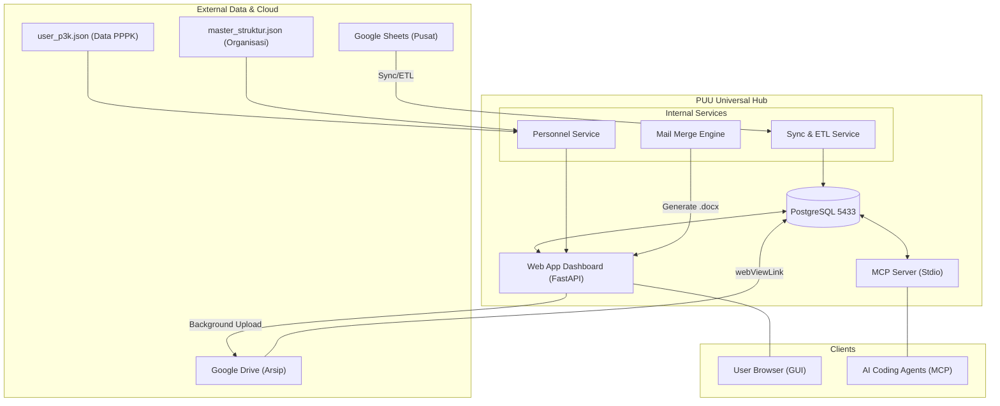
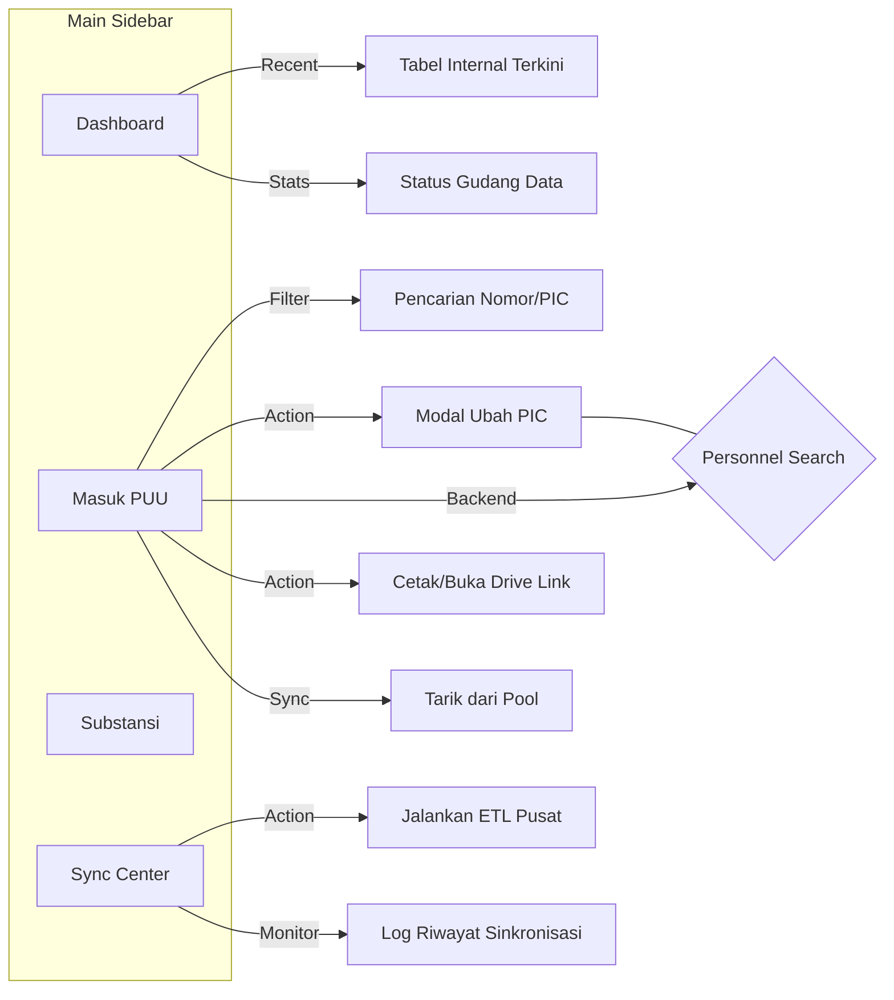

# Korespondensi Universal Web Hub & MCP Server

Aplikasi ini merupakan transformasi terpusat (Universal Server) untuk manajemen korespondensi PUU di lingkungan Kemendagri. Berawal dari server MCP sederhana, sistem ini kini telah ditingkatkan menjadi **Web App Full-Stack Premium** sekaligus **Server MCP** yang membagi basis pengetahuan dan fungsi database yang sama.

## 🌟 Fitur Utama
1. **Web Dashboard Premium**: Dibangun dengan FastAPI dan Jinja2, memiliki antarmuka responsif (*glassmorphism*, dark-accents) untuk melacak *"Pool Data Pusat"*, *"Masuk PUU"*, dan *"Substansi"*.
2. **Pencarian Pegawai Real-time**: Menggunakan akses berbasis Ajax ke sistem `user_p3k.json` tanpa perlu *reload* halaman Web.
3. **Smart Ingestion (Sinkronisasi ETL)**: Terintegrasi dengan script ETL pusat. Dilengkapi dengan lapisan filter ketat (**Strict Regex Filter**) untuk pencegahan *false positive*:
   - **Validasi Registrasi (Kolom Disposisi)**: Menolak baris secara absolut pada berkas mentah *Google Sheets* jika tidak mengandung struktur agenda sah lewat kunci tangkapan `(?i)\d{3,4}/.+/\d{4}` (mendukung format panjang mis: `0252/Set/BU/2026`).
   - **Validasi Posisi (Kolom Posisi)**: Mengekstrak otomatis status fisik berbasis kalender khusus melalui susunan `(?i)PUU.*?\d{1,2}/\d{1,2}`. Memiliki perlindungan *wildcard* sehingga jika ada sisipan teks acak apapun sebelum info tanggal akhir, ia tetap sah masuk antrean masuk tanpa terblokir.
   - **Sinkronisasi Visual**: Antarmuka Web Dashboard secara dinamis mengekstrak tampilan Registrasi *Disposisi* dengan *Substring Regex Regex* sehingga Nomor Agenda yang tampil adalah identitas otentiknya (`0055/Set...`), membuang nomor acak gubahan staf administratif.
4. **Interactive GUI: Assign PIC**: Terdapat tombol pengubah Person in Charge (PIC) di setiap baris antrean dokumen. Saat diklik, sebuah modal pencarian (Live Search via Ajax API) muncul dan mendeteksi ribuan data nama di `user_p3k.json` secara dinamis dari database tanpa memerlukan perombakan halaman.
5. **Auto-Sequence Agenda Persisten (Terkalibrasi Bersih 47 Data Mentah)**: Mengikat nomor sequence permanen (`001-I`, `013-I`, dst). Pengurutan tidak didasari oleh waktu pembuatan surat, melainkan mengekstrak tanggal masuk nyata menggunakan *Regex SQL* dari teks di kolom **"POSISI"** (mis. `PUU 28/1` => 28 Januari). Nomor ini terabadikan (tidak akan bergeser) pada kolom database `agenda_puu` sebagai rekam jejak legal.
6. **Universal MCP Server**: Memberikan sarana untuk AI dan agen eksternal mengakses kemampuan:
   - `cari_surat(query)`: Eksplorasi data di seluruh *pool* database.
   - `status_disposisi(no_surat)`: Ringkasan naratif mengenai rekam historis disposisi dan posisi fisik surat terkini.
7. **Google Drive Auto-Backup & Dynamic Linking**: Seluruh arsip cetak (Mail Merge `.docx`) yang dirender dari Web akan secara otonom diunggah ke Google Drive. Sistem secara cerdas menyalin tautan pratinjau (*Native Preview*) ke database, sehingga tombol cetak di GUI akan berubah menjadi tautan langsung ke Google Docs setelah file tersedia, memastikan *Single Source of Truth* di cloud.
8. **Statistik Beban Kerja PIC (Dashboard Insights)**: Visualisasi real-time berbasis progress bar yang menunjukkan distribusi dokumen per personil (Top 5 PIC). Memungkinkan pimpinan melihat beban kerja tim secara instan tanpa perlu query manual.
9. **Monitor Posisi Surat (Timeline)**: Melacak riwayat pergerakan fisik surat berdasarkan kolom POSISI di Google Sheets. Tiap perubahan posisi dicatat secara otomatis menjadi rangkaian timeline historis di dashboard.

## 🏗️ Struktur Arsitektur



```
korespondensi-server/
├── src/
│   ├── main.py              # Entry point pusat
│   ├── mcp_server.py        # Modul integrasi Model Context Protocol
│   ├── web_app.py           # Aplikasi Web FastAPI
│   ├── database.py          # Modul Koneksi PostgreSQL terpusat
│   └── services/            # Modul logika sinkronisasi data & personel
├── static/                  # Design CSS file
├── templates/               # Koleksi Jinja2 template untuk Web GUI
├── run.sh                   # Script saklar mode aktivasi peladen
└── requirements.txt         # Daftar paket esensial Python
```

## 🖥️ Struktur Navigasi GUI (Web Dashboard)



## 🚀 Setup & Instalasi
Sistem berbasis *Python Virtual Environment* dan menggunakan *PostgreSQL* lokal pada port 5433 (`mcp_knowledge`).

1. Pastikan lingkungan virtual berada di `../.venv`.
2. Lakukan instalasi dependensi:
   ```bash
   /home/aseps/MCP/.venv/bin/python3 -m pip install -r requirements.txt
   ```
3. Konfigurasikan kredensial di `.env` merujuk pada profil `.env.example`.

## ⚙️ Petunjuk Penggunaan
Gunakan script `run.sh` untuk meluncurkan sistem.

**Mode Web App (Dashboard GUI)**
Rute default yang akan berjalan pada host `0.0.0.0` port `8081`. 
- Repositori Utama / Dashboard PUU: `http://localhost:8081`
- Pusat Antrean & Penetapan Dokumen (Internal): `http://localhost:8081/internal`
- Modul Tarik Data Baru Pusat (Sync Center): `http://localhost:8081/sync`
```bash
./run.sh web
```

**Mode MCP Server (Agen AI)**
Berjalan menggunakan komunikasi standar (stdio) khusus digunakan sebagai backend IDE atau LLM integrasi lain.
```bash
./run.sh mcp
```

## 📝 Fitur Mail Merge Lembar Disposisi Secara Native

Sistem ini telah mendukung konversi dan generasi **Lembar Disposisi** (format `.docx`) secara *native* langsung dari Dashboard Web tanpa lagi bergantung pada ekosistem lambat Google Apps Script. 

**Mekanisme Kerja:**
1. **Routing Interaktif**: Terdapat endpoint khusus `/api/disposisi/download/{unique_id}` pada `web_app.py`.
2. **Template Tersentralisasi**: Backend menggunakan modul `docxtpl` untuk mengganti *placeholder* bergaya Jinja (`{{ ... }}`) di dalam basis log template `template_disposisi_native.docx`.
3. **Pengunduhan & Pengalihan Dinamis**: Ketika pengguna menekan tombol **"📄 Cetak Disposisi (.docx)"**, sistem mengecek keberadaan `drive_file_url` di database. Jika ada, pengguna langsung diarahkan ke pratinjau Google Docs. Jika belum ada, file diolah sebagai *download object stream* dan proses unggah ke Drive dipicu di latar belakang.
4. **Auto-Sequence Agenda Persisten**: Sistem secara cerdas mengikat nomor sequence permanen (`001-I`, `013-I`, dst). Pengurutan antrean tidak didasari oleh waktu pembuatan surat, melainkan mengekstrak tanggal sungguhan menggunakan *Regex SQL* dari teks acak di kolom **"POSISI"** (mis. mendeteksi `PUU 28/1` sebagai 28 Januari). Nomor ini permanen tersimpan pada kolom database `agenda_puu` sesaat setelah proses *Ingestion/Sync*.
5. **Otomasi Penuh Field Dokumen**: Seluruh variabel pada *Lembar Disposisi* telah dicetak secara otomatis (Nomor ND, Hal, Asal). Bahkan bagian *Tanggal Diterima*—yang sebelumnya harus dikosongkan untuk input pulpen manual—kini sudah mampu diisi otomatis berkat kemampuan mesin mengekstrak riwayat tanggal dari kolom *POSISI*. (Hanya tersisa tanda tangan fisik saja yang butuh tinta).

## 🗺️ Peta Jalan & Rencana Pengembangan Lanjutan (Roadmap)

Sistem Web Hub Core ini secara aktif terus melebarkan sayapnya:

1. ✅ **[Selesai] Sinkronisasi Otomatis Archiving Google Drive (Background Task)** 
   Sistem telah mem-bypass batas Kuota API dengan metode otentikasi pendelegasian penuh token OAuth. Segala file disposisi hasil render web langsung direplikasi otomat ke balok arsip pusat `1s1Wywe...` via *Multithreading Background Task*.

2. ✅ **[Selesai] Transisi Pemandu Unduhan GUI ke Tautan Dinamis (Drive-Link)**
   Tombol *"📄 Cetak Disposisi"* di antarmuka Web telah ditingkatkan menggunakan logika *Redirect-First*:
   * Mesin mengecek ketersediaan `drive_file_url` yang ada di database.
   * Jika URL tersedia, tombol berubah menjadi **"Buka di Google Docs"** (biru intens) dan mengarahkan pengguna secara interaktif langsung menuju jembatan *Native Preview* Cloud.
   * Hal ini menghapus ancaman duplikasi dan menyemen *Google Cloud* sebagai rel mutlak (*Single Source of Truth*).

3. ✅ **[Selesai] Visualisasi Beban Kerja PIC (Dashboard Analytics)**
   Sistem kini mampu menghitung dan menampilkan statistik Top 5 PIC dengan beban kerja terbanyak langsung di antarmuka dashboard menggunakan bar indikator proporsional.

4. ✅ **[Selesai] Monitor Posisi Surat (Timeline View)**
   Riwayat perjalanan surat kini dipantau otomatis oleh ETL. Tiap perubahan kolom `POSISI` di sumber data akan dicatat sebagai event baru yang kemudian ditampilkan dalam format timeline vertikal di UI "Masuk Internal PUU".
