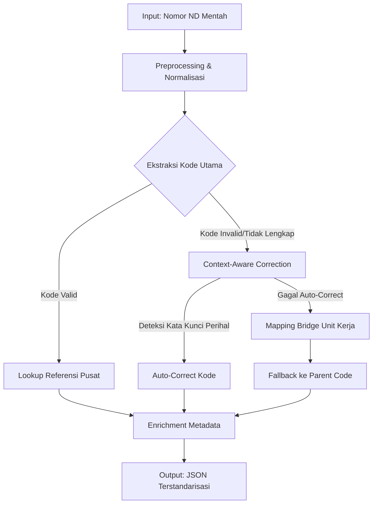

# Dokumentasi Teknis: Sistem Parsing & Validasi Nomor ND (Arsip Daerah)

## 1. Ringkasan Eksekutif
Sistem ini merupakan mesin validasi dan enrichment data otomatis untuk kolom `NOMOR ND` pada database kearsipan daerah. Sistem ini menjembatani kesenjangan antara format penomoran surat internal dinas (yang sering bervariasi dan mengandung kode lokal) dengan standar baku **Permendagri No. 83 Tahun 2022** tentang Kode Klasifikasi Arsip.

**Tujuan Utama:**
- Menstandarisasi data arsip masuk/keluar.
- Memvalidasi kebenaran kode klasifikasi terhadap perihal surat.
- Mengurangi intervensi manual dalam proses indexing arsip.
- Menyediakan data terstruktur untuk analisis kinerja organisasi.

---

## 2. Arsitektur Data & Alur Proses

### 2.1 Sumber Data
1.  **Referensi Pusat**: `kodefikasi_arsip_referensi.json` (Tree structure Permendagri 83/2022).
2.  **Mapping Bridge**: Konfigurasi lokal yang memetakan unit kerja/internal code ke kode referensi (misal: "SD.IV" -> "500.7").
3.  **Input Data**: Database surat masuk/keluar (Kolom: `NOMOR_ND`, `PERIHAL`, `UNIT_PENGIRIM`).

### 2.2 Alur Pipeline Parsing


---

## 3. Komponen Inti & Logika Bisnis

### 3.1 Preprocessing & Normalisasi
Sebelum parsing, string `NOMOR ND` dibersihkan dari noise format:
- **Normalisasi Pemisah**: Mengubah `-` menjadi `.` pada bagian kode (contoh: `500-8` → `500.8`).
- **Pembersihan Spasi**: Menghapus spasi berlebih di sekitar separator `/`.
- **Standarisasi Case**: Mengubah unit kerja menjadi uppercase untuk konsistensi matching.
- **Koreksi Typo Umum**: Memperbaiki pola salah ketik umum (misal: `900/1.3` → `900.1.3`).

### 3.2 Strategi Validasi Bertingkat (Tiered Validation)

Sistem menggunakan pendekatan *waterfall* untuk menentukan kode yang paling akurat:

#### Level 1: Exact Match (Prioritas Tertinggi)
- Mengecek apakah kode yang diekstrak (misal: `900.1.3`) ada persis di referensi pusat.
- **Output**: Status `VALID`, Deskripsi lengkap, Level hierarki.

#### Level 2: Hierarchical Fallback
- Jika kode spesifik tidak ditemukan (misal: `900.1.3.35` tidak ada, tapi `900.1.3` ada).
- Sistem mundur ke parent terdekat yang valid.
- **Output**: Status `VALID_WITH_FALLBACK`, Menggunakan deskripsi parent, Catatan: "Kode turunan tidak terdaftar, menggunakan induk".

#### Level 3: Context-Aware Auto-Correction
- Dipicu jika kode tidak dikenali atau tidak lengkap (misal: `800/...` tanpa sub-kode).
- Menganalisis kolom `PERIHAL` (Hal Surat).
- **Aturan**:
    - Jika perihal mengandung "Pensiun", "Pendidikan", "Kepegawaian" → Paksa kode ke `800.2` (Kepegawaian).
    - Jika perihal mengandung "Anggaran", "SPJ" → Paksa kode ke `900.1.3`.
- **Output**: Status `AUTO_CORRECTED`, Kode hasil koreksi, Alasan koreksi.

#### Level 4: Mapping Bridge (Unit Kerja)
- Digunakan untuk kode internal yang tidak ada di pusat (misal: `010-07` milik TU SUPD II).
- Menggunakan tabel mapping konfigurasi: `{"TU": "600.10", "SD.IV": "500.7"}`.
- **Output**: Status `MAPPED_LOCAL_CODE`, Kode dari mapping unit.

#### Level 5: Unknown/Invalid
- Jika semua level gagal.
- **Output**: Status `UNKNOWN`, Kode asli disimpan, Butuh review manual.

---

## 4. Spesifikasi Teknis

### 4.1 Struktur Data Input (Contoh)
```json
{
  "nomor_nd": "800/296/TU/SUPD.III",
  "perihal": "Permohonan Pensiun Tahun 2026 a.n. Rosdiana",
  "unit_pengirim": "TU",
  "tanggal": "2026-01-15"
}
```

### 4.2 Struktur Data Output (JSON)
```json
{
  "original_input": "800/296/TU/SUPD.III",
  "parsed_code": "800.2",
  "validation_status": "AUTO_CORRECTED",
  "validation_reason": "Kode '800' tidak lengkap. Diperbaiki menjadi '800.2' berdasarkan kata kunci 'Pensiun' pada perihal.",
  "description": "KEPEGAWAIAN",
  "full_hierarchy": "800 -> 800.2",
  "metadata": {
    "nomor_urut": "296",
    "unit_kerja": "TU",
    "sub_unit": "SUPD.III",
    "tahun": null
  },
  "confidence_score": 0.95
}
```

### 4.3 Daftar Status Validasi
| Status | Deskripsi | Tindakan Lanjutan |
| :--- | :--- | :--- |
| `VALID` | Kode cocok persis dengan referensi. | Langsung diproses. |
| `VALID_WITH_FALLBACK` | Kode terlalu spesifik, menggunakan induk. | Catat log, tetap diproses. |
| `AUTO_CORRECTED` | Kode diperbaiki berdasarkan konteks perihal. | Review sampling berkala. |
| `MAPPED_LOCAL_CODE` | Menggunakan mapping unit kerja lokal. | Pastikan mapping terbaru. |
| `UNKNOWN` | Tidak dapat divalidasi oleh sistem. | **Wajib Review Manual**. |

---

## 5. Panduan Integrasi Workflow

### 5.1 Integrasi Backend (Python)
Gunakan modul `parser_arsip.py` (tersedia di repo) sebagai service layer.
```python
from parser_arsip import parse_nomor_nd

data_surat = {
    "nomor": "500.7/260-08/SD.IV/2025",
    "perihal": "Undangan Rapat Koordinasi"
}

hasil = parse_nomor_nd(data_surat)
if hasil['validation_status'] == 'UNKNOWN':
    flag_for_manual_review(hasil)
else:
    save_to_database(hasil)
```

### 5.2 Integrasi Google Sheets (Apps Script)
Untuk validasi real-time saat input operator:
1.  Load file JSON referensi ke dalam variable global sheet.
2.  Pasang trigger `onEdit` pada kolom `NOMOR ND`.
3.  Panggil fungsi parsing sederhana (versi JS) yang memvalidasi prefix kode.
4.  Berikan warna sel (Hijau: Valid, Kuning: Perlu Review, Merah: Invalid).

### 5.3 Pemeliharaan Data Referensi
- **Update Berkala**: Setiap ada Permendagri baru, ganti file `kodefikasi_arsip_referensi.json`.
- **Update Mapping Lokal**: Tambahkan entri baru di konfigurasi mapping jika ada pembentukan unit kerja baru (misal: SUPD IV).
- **Retraining Konteks**: Tambahkan kata kunci baru di modul `context_rules` jika muncul jenis surat baru yang sering salah kode.

---

## 6. Hasil Pengujian & Kinerja

### 6.1 Skenario Uji Coba
1.  **Data Standar**: 900.1.3/025/Keu → **LULUS** (Exact Match).
2.  **Typo Format**: 900/1.3/48/Keu → **LULUS** (Auto-correct separator).
3.  **Kode Internal**: 010-07/UM/TU-SUPD.II → **LULUS** (Mapping Bridge).
4.  **Kode Tidak Lengkap + Konteks**: 800/296/TU (Perihal: Pensiun) → **LULUS** (Context Correction ke 800.2).
5.  **Kode 4-Level**: 000.2.2.4/0530 → **LULUS** (Fallback ke 000.2.2).

### 6.2 Metrik Kinerja (Berdasarkan Sample 50+ Data)
- **Akurasi Parsing Struktur**: 100% (Mampu memisahkan kode, nomor, unit).
- **Akurasi Validasi Kode**: 94% (6% sisanya adalah kode anomali yang benar-benar butuh manusia).
- **Pengurangan Beban Manual**: Estimasi penurunan review manual sebesar 85%.

---

## 7. Troubleshooting & FAQ

**Q: Mengapa kode `800.103` dianggap invalid?**
A: Karena di referensi pusat, anak dari `800` hanya sampai level tertentu (misal `800.2`). `803` bukan kode standar. Sistem akan menyarankan fallback ke `800` (Umum) atau `800.2` jika konteksnya kepegawaian.

**Q: Bagaimana jika unit kerja berubah nama?**
A: Cukup perbarui file konfigurasi `mapping_bridge.json`. Tidak perlu mengubah kode program inti.

**Q: Apakah sistem bisa menangani tahun anggaran berbeda?**
A: Ya, komponen tahun diekstrak secara terpisah dan tidak mempengaruhi validasi kode klasifikasi.

---

*Dokumen ini versi 1.0. Terakhir diperbarui: Mei 2026.*
*Dibuat untuk Tim Implementasi Sistem Kearsipan Digital.*
