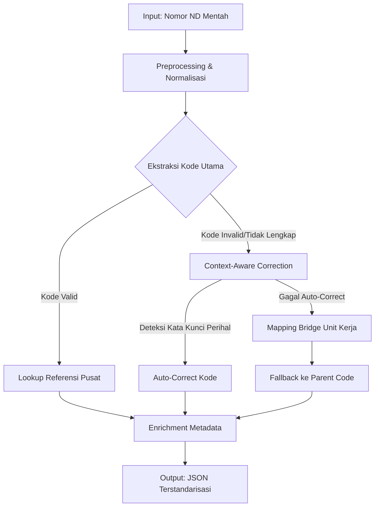

# Dokumentasi Teknis: Sistem Parsing & Validasi Nomor ND (Arsip Daerah)

## 1. Ringkasan Eksekutif
Sistem ini merupakan mesin validasi dan enrichment data otomatis untuk kolom `NOMOR ND` pada database kearsipan daerah. Sistem ini menjembatani kesenjangan antara format penomoran surat internal dinas (yang sering bervariasi dan mengandung kode lokal) dengan standar baku **Permendagri No. 83 Tahun 2022** tentang Kode Klasifikasi Arsip.

**Tujuan Utama:**
- Menstandarisasi data arsip masuk/keluar.
- Memvalidasi kebenaran kode klasifikasi terhadap perihal surat.
- Mengurangi intervensi manual dalam proses indexing arsip.
- Menyediakan data terstruktur untuk analisis kinerja organisasi.

---

## 2. Arsitektur Data & Alur Proses

### 2.1 Sumber Data
1.  **Referensi Pusat**: `kodefikasi_arsip_referensi.json` (Tree structure Permendagri 83/2022).
2.  **Mapping Bridge**: Konfigurasi lokal yang memetakan unit kerja/internal code ke kode referensi (misal: "SD.IV" -> "500.7").
3.  **Input Data**: Database surat masuk/keluar (Kolom: `NOMOR_ND`, `PERIHAL`, `UNIT_PENGIRIM`).

### 2.2 Alur Pipeline Parsing


---

## 3. Komponen Inti & Logika Bisnis

### 3.1 Preprocessing & Normalisasi (ULA Standard)
Sebelum parsing, string `NOMOR ND` dibersihkan dari noise format yang sering muncul akibat input manual di ULA:
- **Normalisasi Pemisah**: Mengubah `-` menjadi `.` pada bagian kode (contoh: `500-8` → `500.8`).
- **Pembersihan Spasi**: Menghapus spasi berlebih di sekitar separator `/`.
- **Dynamic Segment Detection**: Sistem tidak lagi mengandalkan urutan kolom yang kaku, melainkan menggunakan Regex untuk mendeteksi mana yang merupakan Tahun, Unit Kerja (`BU`, `KEU`, `PUU`), dan Kode Klasifikasi.

### 3.2 Strategi Intelijen Validasi (Triangulasi)

Sistem menggunakan prinsip **Triangulasi Data** untuk menentukan tingkat validitas:

1.  **Unit vs Kode**: Setiap unit memiliki "Kamus Ekspektasi Kode".
    - `KEU` (Keuangan) → Ekspektasi: `900`.
    - `PUU` (Hukum) → Ekspektasi: `100` atau `180`.
    - `PRC` (Perencanaan) → Ekspektasi: `000.3`.
2.  **Substansi vs Kode**: Menganalisis kata kunci pada "Perihal" untuk mengonfirmasi kode klasifikasi.
3.  **Otonomi Nomor Urut**: Sistem mengakui bahwa nomor urut (Segmen 2) bersifat independen per bagian. Duplikasi nomor `93` antara `BU` dan `KEU` dianggap **VALID**.

---

## 4. Anomaly Scoring & Quality Flagging

Sistem memberikan nilai **Anomaly Score (0-100)** untuk setiap input:

| Score | Status | Deskripsi |
| :--- | :--- | :--- |
| **0 - 20** | **CLEAN** | Struktur sempurna, kode sesuai dengan unit dan perihal. |
| **21 - 50** | **WARNING** | Struktur standar, namun kode tidak ditemukan di Permendagri (Fallback ke Induk). |
| **51 - 80** | **ANOMALY** | Ketidaksesuaian antara Unit dan Kode (misal: Unit KEU memakai kode 100). |
| **81 - 100** | **CRITICAL** | Kontradiksi total antara Perihal, Kode, dan Unit. Potensi salah input fatal di ULA. |

---

## 5. Spesifikasi Teknis Parser Intelijen (`parser_nomor_nd.py`)

### 5.1 Contoh Pemetaan Struktur Sekretariat
**Input**: `900.1.8.2/112/BU/SET`
**Hasil Mapping**:
```json
{
  "kode_klasifikasi": "900.1.8.2",
  "nomor_urut": "112",
  "unit_pengolah": "BU",
  "unit_induk": "SET",
  "validation": {
    "is_consistent": true,
    "deskripsi": "Pembayaran Honorarium/Upah",
    "anomali_score": 0
  }
}
```

---

## 6. Integrasi Master Struktur (Bangda JSON)

Parser terintegrasi dengan `master_struktur_bangda_2025.json` untuk:
- Memvalidasi hirarki Subdit di bawah Direktorat.
- Memastikan singkatan unit (misal: `SD.I`) terpetakan ke nama bidang yang benar.

---

*Dokumen ini versi 2.0 (Intelligence Edition). Terakhir diperbarui: April 2026.*
*Fokus: Validasi Struktural & Anomaly Detection.*
